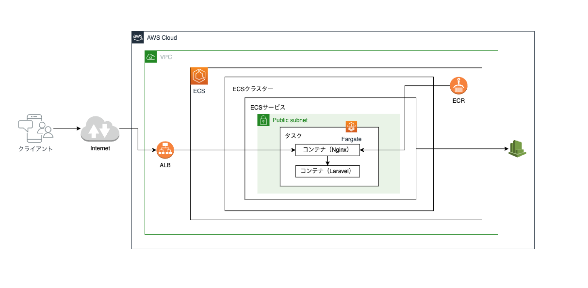

## Deploy Laravel on AWS using Fargate


## Tools

**ECR push**
```
sh tools/aws-ecr-login.sh

sh tools/util.sh build
sh tools/util.sh push
```

**Task Definition**
```
sh tools/util.sh createTaskDefinition
```

**Run Batch**
```
sh tools/util.sh batch
```


**Deploy**
```
sh tools/util.sh deploy
```
